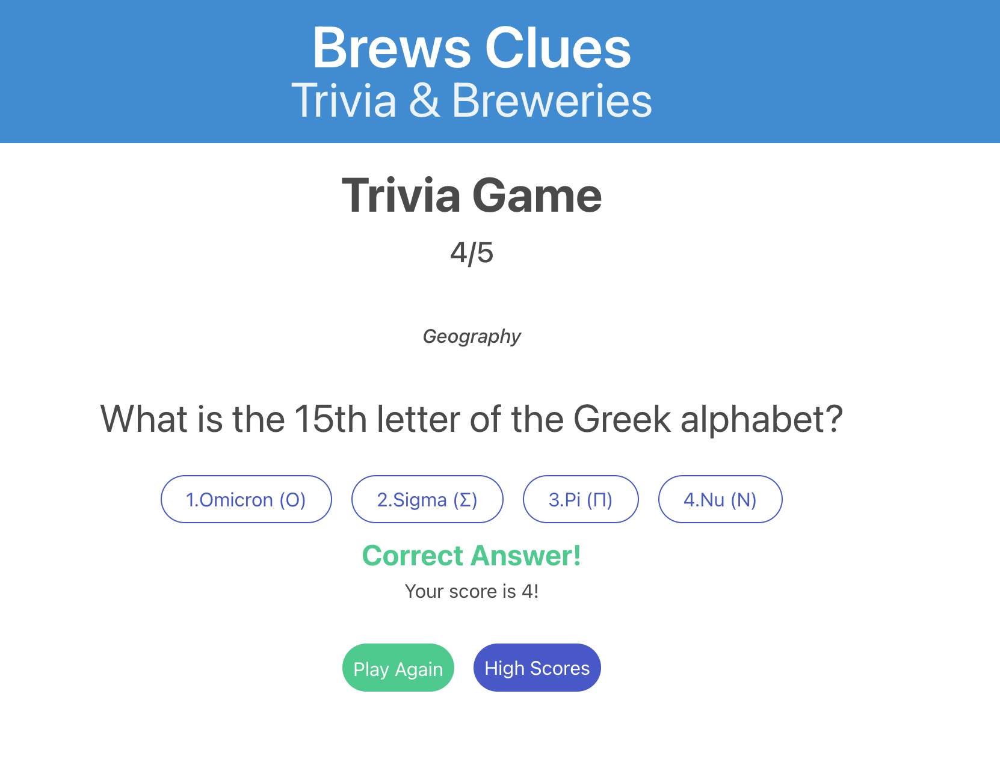
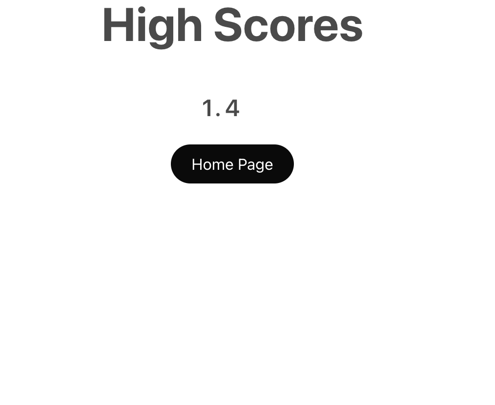
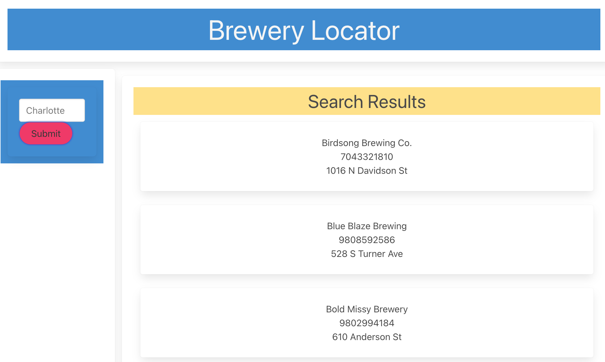

# Brews Clue's 

## Purpose 
    This site is built to display a trivia app that challenges your general knowledge. Once you are done with a quiz scroll down and find a local brewery to celebrate your intelligence. 

## Brews Clue's Website

## Made
HTML 
CSS
JavaScript 
Bulma
Jquery 
Open Trivia Data Base API
Open Brewery Data Base API 

## Created by 

Carson Mohr
Jason Oliver 
Patrick Cranford 

### Links 

# PowerPoint Presentation :

https://docs.google.com/presentation/d/1FkQws1LCYrAmSbdQO2rG7RrmoP432gQcmlmY0ESSTXs/edit#slide=id.p

# Github Repo :

https://github.com/PGCranford/Brew-s-Clues-

# Website URL:

https://pgcranford.github.io/Brew-s-Clues-/

